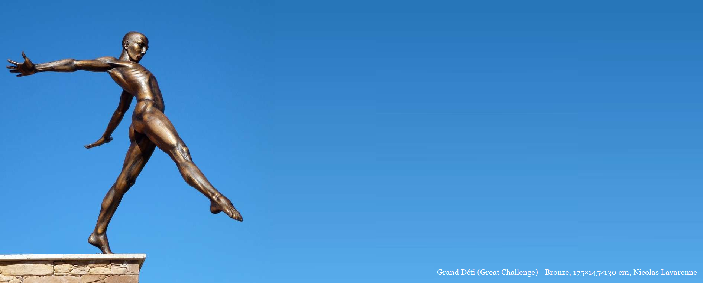
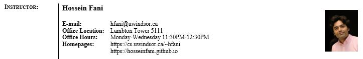

# The Unix Reloaded! 
Materials for the Computer Science course System Programming.

    
    

        <a href="https://www.artseiller.com/en/nicolas-lavarenne-en">https://www.artseiller.com/en/nicolas-lavarenne-en</a> 
    
    

This course introduces students to advanced software development techniques in system programming using the C language in the ``UNIX`` environment. Topics include introduction to modern operating systems, system calls, managing processes, the use of ``fork`` and ``exec``, signals, file processing, filters, pipes, scripting languages, introduction to concurrency (e.g. synchronization), network programming (e.g. using sockets), client-server problems.

    
      
      
      
    
          

## License
©2021. All materials available here are licensed under a [CC BY-NC-SA 4.0](LICENSE.txt) license. 
